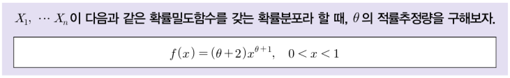

# 데이터분석 스터디(2주차) - 추정과 가설검정

---

---

# 1. 추정(Estimation)

---

- 통계조사의 주목적 : 관찰대상인 모집단을 알고자 하는 것
    - `모수` : 모집단의 특성을 결정짓는 상수
    - `통계량` : 표본으로부터 얻을 수 있는 모수에 대응되는 개념
    - `추정량` : 모집단의 모수를 추정하기 위해 사용되는 통계량
- 추정의 종류
    - `점추정` : 표본으로부터 얻은 어떤 특정한 값으로 모수를 추정하는 것
    - `구간추정` : 모수를 포함하리라 생각되는 구간으로 추정하는 것

## 1.1 바람직한 추정량의 성질

---

1. `불편성(Unbiasedness)` 
    - 모수 $\theta$의 추정량을 $\hat{\theta}$으로 나타낼 때, $\hat{\theta}$의 기대값이 $\theta$가 되는 성질이다. 즉, $E(\hat{\theta})=\theta$을 불편추정량이라 한다.
2. `일치성(Consistency)` 
    - 표본의 크기가 커짐에 따라 추정량 $\hat{\theta}$이 확률적으로 모수 $\theta$에 가깝게 수렴하는 성질이다.
3. `충분성(Sufficiency)` 
    - 모수에 대하여 가능한 많은 표본정보를 내포하고 있는 추정량의 성질이다.
4. `효율성(Efficiency)` 
    - 추정량 $\hat{\theta}$이 불편추정량이고, 그 분산이 다른 추정량 $\hat{\theta}_i$에 비해 최소의 분산을 갖는 성질이다.

## 1.2 점추정(Point Estimation)

---

1. `모평균의 점추정`
    - 표본평균 $\bar{X}$ ⇒ 모평균 $\mu$
2. `모분산의 점추정`
    - 표본분산 $S^2$ ⇒ 모분산 $\sigma^2$
3. `모비율의 점추정`
    - 표본비율 $\hat{p}$ ⇒ 모비율 $p$

## 1.3 점추정 방법

---

1. `적률법(Method of Moment)`
    - 모집단의 $r$차 적률 : $\mu_r=E(X^r)$
    - 표본의 $r$차 적률 : $\hat{\mu}_r=\frac{1}{n}\Sigma{X_i^r}$
    - 모집단의 적률과 표본의 적률을 같다($\mu_r=\hat{\mu_r}$)고 놓고 해당 모수에 대해 추정량을 구하는 방법
    
    ⇒ 모수 $\theta$에 대한 적률추정량(MME ; Method of Moments Estimator)이라 함
    
    - 예제
        
        
        
        - 문제 풀이
            
            
            
2. `최대가능도추정법(Method of Maximum Likelihood)`
    - 가능도함수 $L(\theta)=f(x_1, \cdots, x_n;\theta)=f(x_1|\theta)\cdot f(x_2|\theta)\cdots f(x_n|\theta)$
        - $n$개의 관측값 $x_1, \cdots, x_n$에 대한 결합밀도함수
    - $L(\theta)$를 최대로 하는 $\theta$의 값 $\hat{\theta}$을 구하는 방법
    - 가능도함수 $L(\theta)$를 최대로 하는 $\theta$는 로그가능도함수인 $logL(\theta)$ 또한 최대로 하므로 많은 경우 계산의 편의상 가능도함수 $L(\theta)$보다 로그를 취한 로그가능도함수 $logL(\theta)$를 이용
    
    ⇒ 모수 $\theta$에 대한 최대가능도추정량(MLE ; Maximum Likelihood Estimator)이라 함
    
    - 예제
        
        
        
        - 문제 풀이
            
            
            

## 1.4 구간추정(Interval Estimation)

---

- 점추정에서는 모평균 $\mu$, 모분산 $\sigma^2$, 모비율 $p$를 추정하기 위해 $\bar{X}, S^2, \hat{p}$의 값을 사용
    - 이 값들이 얼마나 정확하게 모수를 추정하고 있는지 모름
    - 이러한 단점을 보완하는 방법으로 점추정에 오차의 개념을 추가하여 구간으로 모수를 추정하는 방법이 구간추정

### 1.4.1 신뢰구간(Confidence Interval)

---

- `신뢰구간` : 일정한 구간을 제시하여 모수가 포함되었을 것이라고 제시한 구간
    - 구간추정은 이 신뢰구간을 이용한 추정 방법
    - 구간추정에서 95% 신뢰구간이란 추정하고자 하는 모수를 포함할 확률이 대략 95%를 의미

### 1.4.2 신뢰수준(Confidence Level)

---

- `신뢰수준` : 구간추정값이 모수에 대해 얼마나 잘 설명하는가를 표시하는 확률값
    - 신뢰수준 95%라 함은, 똑같은 연구를 똑같은 방법으로 100번 반복해서 신뢰구간을 구하는 경우, 그 중 적어도 95번은 그 구간 안에 모평균이 포함될 것임을 의미
    - 즉, 모평균의 위치를 맞추지 못하는 실수는 5% 이상 되지 않는다는 의미
    - 추정량의 분포가 정규분포를 따를 때 모수 $\mu$에 대한 $\pm\sigma, \pm2\sigma, \pm3\sigma$의 신뢰수준은 다음과 같음
    
    
    

### 1.4.3 신뢰계수(Confidence Coefficient)

---

- `신뢰계수` : 추정량의 분포와 신뢰수준에 의해 결정되는 값
    - 예를 들어 추정량의 분포가 정규분포를 따를 때 모수 $\mu$에 대한 각각의 신뢰구간은 다음과 같음
        1. $\mu$의 90% 신뢰구간 = $\bar{X}\pm1.645\frac{\sigma}{\sqrt{n}}$
        2. $\mu$의 95% 신뢰구간 = $\bar{X}\pm1.96\frac{\sigma}{\sqrt{n}}$
        3. $\mu$의 99% 신뢰구간 = $\bar{X}\pm2.575\frac{\sigma}{\sqrt{n}}$
    - 여기서 90%, 95%, 99%를 신뢰수준이라 하고, $z_{0.05}=1.645, z_{0.025}=1.96, z_{0.005}=2.575$를 신뢰계수라 하며, $\frac{\sigma}{\sqrt{n}}$을 표준오차라 한다. 즉, 위의 식을 간단히 표현하면 다음과 같다.
    
    
    
    - 여기서 $\mu$는 확률변수가 아닌 모집단의 모수로서 상수이며, 이 모수에 대한 90%, 95%, 99%의 신뢰수준에 해당하는 각각의 신뢰계수를 그림으로 나타내면 다음과 같음
    
    
    
    
    
    
    
    - 신뢰수준을 높이면 신뢰계수가 커지고 신뢰구간이 넓어지며, 신뢰수준을 낮추면 신뢰계수가 작아지고 신뢰구간이 좁아짐

## 1.5 구간추정의 종류

---

1. 대표본($n\ge30$)에서 모평균 $\mu$에 대한 $100(1-\alpha)\%$ 신뢰구간
    - 모평균 $\mu$의 추정량은 표본평균 $\bar{X}$이며, 대표본인 경우 $\bar{X}$를 표준화한 $Z$통계량을 이용한다.
    
    
    
    
    
    - 실제자료에서 모집단의 분포가 정밀한 정규분포를 따르는 경우는 없음
        - 모분산 $\sigma^2$이 알려져 있는 경우도 거의 없음
        - 표본의 크기 $n$이 충분히 클 때에는 중심극한정리에 의해 표본평균 $\bar{X}$는 근사적으로 정규분포를 따르며 모분산 $\sigma^2$은 표본분산 $S^2$으로 추정될 수 있음
    - 이외에도,
        - 소표본에서 모평균에 대한 신뢰구간 → $t$통계량
        - 대표본에서 모비율에 대한 신뢰구간 → $Z$통계량
        - 독립표본인 경우 두 모평균의 차에 대한 신뢰구간 → $Z$통계량
        - 대응표본인 경우 두 모평균의 차에 대한 신뢰구간 → $Z$통계량
        - 대표본에서 두 모비율의 차에 대한 신뢰구간 → $Z$통계량
        - 모분산에 대한 신뢰구간 → $\chi^2$통계량
        - 모분산의 비에 대한 신뢰구간 → $F$통계량

## 1.6 표본크기 결정

---

1. 모평균의 추정에 필요한 표본크기 결정
    - $X_1, X_2, \cdots, X_n$은 평균이 $\mu$, 분산이 $\sigma^2$인 모집단에서의 확률표본
        - 모평균 $\mu$의 $100(1-\alpha)\%$ 신뢰구간 ⇒ $\bar{X}\pm z_{\frac{\alpha}{2}}\frac{\sigma}{\sqrt{n}}$
        - $\frac{\sigma}{\sqrt{n}}$을 표준오차라 하고, $z_{\frac{\alpha}{2}}\frac{\sigma}{\sqrt{n}}$을 추정오차(오차한계)라 하며, 추정오차가 $d$ 이내가 되도록 하려면 $z_\frac{\alpha}{2}\frac{\sigma}{\sqrt{n}}\le d$로부터 다음과 같이 표본의 크기 $n$을 결정할 수 있음
        
        
        
        - 예제1
            
            
            
            - 문제 풀이
                
                
                
        - 예제2
            
            
            
            - 문제 풀이
                
                
                

# 2. 가설검정

---

- 가설검정 : 연구자가 모수의 값을 먼저 가정한 뒤에 표본에서 얻어진 통계량 값이 모수와 어느 정도 일치하는지 혹은 일치하지 않는지 통계적으로 결정하는 절차
    - 즉, 모집단에 대한 어떤 주장 및 추측을 받아들이거나 기각하는 결정을 내리는 통계적 방법

## 2.1 가설검정의 과정

---

- 가설검정은 모집단의 모수에 대해 사전에 설정한 가설이 주어진 확률범위 내에서 통계적으로 유의한지를 사후적으로 분석하는 과정으로 다음과 같음

## 2.2 귀무가설($H_0$)과 대립가설($H_1$)

---

- `귀무가설($H_0$)`
    - 기존부터 받아들여져 왔던 가설
- `대립가설($H_1$)`
    - 연구자가 새롭게 주장하고자 하는 가설

⇒ 분석하는 사람의 입장에서는 대립가설을 채택(귀무가설을 기각)하기를 원함

<aside>
📌

**가설검정의 형태**

---

- `단측검정`
    - 사전정보에 의해 표본분포의 한쪽에 관심을 가지고 시행하는 검정 방법
- `양측검정`
    - 사전정보가 없거나 표본분포의 양쪽에 관심을 가지고 시행하는 검정 방법
</aside>

## 2.3 검정통계량 값에 의한 검정기준

---

- `검정통계량`
    - 검정의 기준을 결정하는 통계량으로 검정통계량 값이 어느 범위에 위치하는지에 따라 귀무가설을 기각 또는 채택
- `기각치(임계치)`
    - 기각범위와 채택범위를 구별시켜주는 값으로 검정통계량 값이 기각치를 기준으로 기각범위에 포함될 경우 귀무가설을 기각
    
    
    

## 2.4 제1종의 오류와 제2종류

---

- `제1종의 오류`
    - 귀무가설이 옳음에도 불구하고 대립가설을 선택하는 오류
- `제2종의 오류`
    - 대립가설이 옳음에도 불구하고 귀무가설을 선택하는 오류
    
    
    
- `유의수준($\alpha$)`
    - 제1종의 오류를 범할 확률 → 귀무가설이 참일 때 대립가설을 채택하는 오류를 범할 확률
    - 거짓된 결론을 내리는 위험을 줄이기 위해서 사용
    - 예를 들어, 신약 개발 과정에서 제1종 오류가 발생하면 효과가 없는 약을 효과가 있다고 잘못 결론 내릴 수 있는데, 이는 환자에게 부작용을 초래하거나, 잘못된 치료를 제공할 수 있으므로 매우 위험
    
    
    
- `$\beta$`
    - 제2종의 오류를 범할 확률 → 대립가설이 참일 때 귀무가설을 채택하는 오류를 범할 확률
    - 예를 들어, 범죄자의 유죄 여부를 판단하는 법정에서 제2종 오류가 발생하면, 실제로는 유죄인 사람이 무죄로 판결될 수 있음
    
    
    
- 제1종의 오류와 제2종의 오류는 상호 역의 관계에 있으므로 제1종의 오류를 범할 확률을 증가시키면 제2종의 오류를 범할 확률은 감소하고 제1종의 오류를 범할 확률을 감소시키면 제2종의 오류를 범할 확률은 증가함(trade-off 관계)

## 2.5 가설검정 절차에 따른 검정통계량

---

<aside>
📌

**독립표본 t검정과 대응표본 t검정의 차이 비교**

---

- 독립표본과 대응표본 비교

- 독립표본 t검정과 대응표본 t검정의 적용 예

</aside>

## 2.6 결정원칙

---

- 가설의 기각여부는 귀무가설을 기준으로 생각하지만, 결론은 대립가설을 기준으로 기술함
    - 귀무가설을 기각하면 대립가설은 통계적으로 유의함
- `신뢰수준`
    - 통계적 추정에서 구간으로 추정된 추정치가 실제 모집단의 모수를 포함하고 있을 가능성의 범위
    - 신뢰수준 = $1-\alpha$
    
    
    
1. `좌측검정인 경우($H_0 : \mu_1=\mu_0, H_1 : \mu<\mu_0$)`
    
    
    
2. `우측검정인 경우($H_0 : \mu_1=\mu_0, H_1 : \mu>\mu_0$)`
    
    
    
3. `양측검정인 경우($H_0 : \mu_1=\mu_0, H_1 : \mu\ne\mu_0$)`
    
    
    

## 2.7 대립가설 형태에 따른 기각역

---

## 2.8 검정력과 유의확률

---

- `검정력(Power)`
    - 참인 대립가설을 올바르게 검출할 수 있는 능력
    - 검정력($1-\beta$)은 전체 확률 1에서 제2종의 오류를 범할 확률 $\beta$를 뺀 확률로, 대립가설이 참일 때 귀무가설을 기각할 확률이다.
    
    
    
    - 제1종의 오류($\alpha$)를 고정시킨 상태에서 표본의 크기를 증가시키면 제2종의 오류($\beta$)를 감소시킬 수 있음
        - 검정력은 $1-\beta$이므로 제2종의 오류($\beta$)가 감소되면 검정력은 증가한다.
        - 같은 유의수준과 같은 표본크기에서는 검정력이 큰 검정법이 더 좋은 검정법

- `유의확률($p-value$)`
    - 귀무가설이 참이라는 가정하에 관측된 데이터가 나타날 확률
        - 귀무가설이 사실이라는 전제하에 검정통계량이 표본에서 계산된 값과 같거나 그 값보다 대립가설 방향으로 더 극단적인 값을 가질 확률
        - $p$값은 검정통계량 값에 대해서 귀무가설을 기각시킬 수 있는 최소의 유의수준으로 귀무가설이 사실일 확률이라 생각할 수 있음
    
    
    
    - p-value가 작을수록 : 관측된 데이터가 귀무가설 하에서 발생할 가능성이 낮음
        - 귀무가설을 기각하고 대립가설을 채택할 가능성이 높아진다는 의미
    - p-value가 클수록 : 관측된 데이터가 귀무가설 하에서 발생할 가능성이 높음
        - 귀무가설을 기각할 근거가 부족하다는 의미

<aside>
📌

**유의수준과 유의확률이 동일한 경우**

---

</aside>

<aside>
📌

**검정형태에 따른 $p$값의 계산**

---

- $\bar{x}_{obs}$는 표본으로부터 관측된 표본평균을 나타낸다.
</aside>